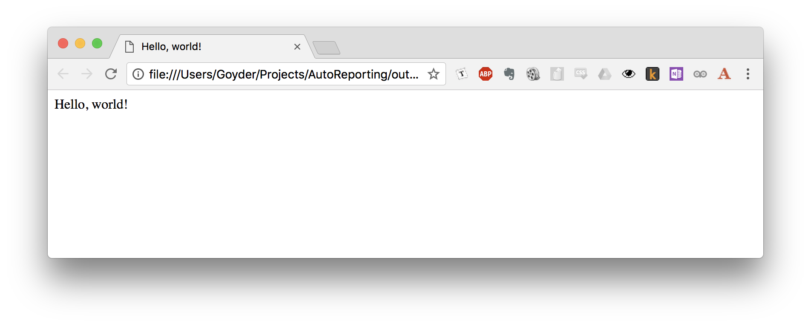

# Automatic Reporting in Python
## Part 2 - From Hello World to Real Insights

As outlined in my previous post, the goal of this project is to make an automatic reporting tool.

In this guide, the outcome I'm shooting for is a single HTML page that allows me to interrogate and compare the outputs of machine learnings models.


At the [conclusion of the previous tutorial](https://dev.to/goyder/automatic-reporting-in-python---part-1-from-planning-to-hello-world-32n1), we'd gotten up to the "Hello, World!" stage. Some very basic content could be fed into our very basic structure - but now it's time to add some real features.

### A note on tutorials and design choices

Rather than just providing a dump of code that works, I'd like to incrementally work through the development, step-by-step. 

Personally, I've always found this kind of tutorial more effective as:

* It gives an insight of how someone else approaches a problem
* It actually reflects how I code - feature by feature, commit by commit.

When I was totally fresh to programming, I worked from a large number of tutorials. The structure of most tutorials gives you the impression that there is one and only one way to accomplish the goal that the tutorial sets out to do - and, admittedly, sometimes there is, depending on how niche and technical the tutorial is. 

But more often I've found that any programming job, even the very small, requires choices and trade-offs to be made in the implementation of the solution from the get-go. Should this be a function or a class? Do I import a library or roll my own? Should I be using a dictionary or a list? What kind of flow-on effects are these choices going to have?


### One approach to simplify things: mark your assumptions

Now, there's obviously no simple solution to any of these challenge. However, one approach to making this process easier is being clear on the assumptions underpinning your project. 

For instance, in this project:
* I am the only consumer of these reports, and therefore;
* My users (me!) will not be hostile
* A minimum of error-checking is required, as I can interrogate and troubleshoot myself
* An internet connection is available
* Portability is not required

Most of these are simplifying assumptions that serve to make clear exactly how thorough or involved my solution needs to be. OF course, as soon as you start looking at providing your code to others, or in an enterprise situation, or if a higher degree of automation is required, the game can change significantly!

It makes the ecosystem in which this tool will exist a bit clearer.  When I get stuck and I'm not sure where to go, I'll refer back to these assumptions and see if I've not answered my own question somewhere.

---

## Step Three - Generate some data to work with

As mentioned in [Part 1 of this Post](https://dev.to/goyder/automatic-reporting-in-python---part-1-from-planning-to-hello-world-32n1), there are a host of use-cases for this tool that come from the machine learning space. 

In this case, we'll consider the following scenario:
* We have an existing, baseline model that determines whether an image contains a **cat**.
* We regularly develop new models that carry out the same task. These models may or may not be an improvement on your baseline model.
* Every time we develop a new model, we run it over an existing set of data and capture the outputs. In this case, the outputs are what the model believes to be in each image.

It would therefore be convenient to be able to:

2. Automatically review these outputs and get a status report on how the new model did.
3. Automatically compare the performance of these models against each other. Where did one outperform the other? Are there images that both struggle with?

For the purposes of this study, we'll assess the performance of two models in the well respected field of detecting cats in images. [**VGG19**](https://arxiv.org/abs/1409.1556), the first model, is a well respected and important image classifier. [**MobileNet**](https://arxiv.org/abs/1704.04861) is a significantly more lightweight architecture (running approximately six times faster than VGG19, for example) but with reduced accuracy. 

The use of these models to generate the data can be found under a separate repo, [available here](https://github.com/goyder/dataset_generation). While the process of generating this data is a bit beyond the scope of this discussion, the end-result is we have two datasets to play with - `VGG19_results.csv` and `MobileNet_results.csv` - each stored as [CSV files](https://en.wikipedia.org/wiki/Comma-separated_values). 


For each image in the dataset, we have a column for the predicted ImageNet category ID (`imagenet_index`), the text description of the category (`imagenet_category`), and whether this corresponds to a housecat (`correct`). 

___

## Step Four - Set up a structure to put things in 

Well - after our digressions - back to the reporter. When we left off, we had the reporter in a functional but featureless state:



Let's make the next move by adding a basic stucture to the report that we can populate with more sections of content. First, we'll update `report.html`. We'll make some minor tweaks, like specifying an actual `title` point to be entered and adding a brief preamble, but the real interesting part is below that:

**`report.html`**

```html
<!DOCTYPE html>
<html lang="en">
<head>
    <meta charset="UTF-8">
    <title>{{ title }}</title>
</head>
<body>
<h1>{{ title }}</h1>
<p>This report was automatically generated.</p>

    {{ section }}

</body>
</html>
```

We're limited to inserting blocks of text into our template - Jinja allows control flow structures! In this case, we'll feed in some iterable variable `sections` - note the plural - and then we'll publish each `section`  object within.

But what are we to include in these sections? As a first run, we can generate a section for each model that displays a brief bit of information about the model output, and then displays the results. Let's create a new template, `table_section.html`, 
that we'll use to render this information.

**`table_section.html`**

```html
<h2>{{ model }} - Model Results</h2>
<p>Results for each image as predicted by model <i>'{{ model }}'</i>, as captured in file <i>'{{ dataset }}'</i>.</p>
{{ table }}
```

Nice and simple - this gives us all the structure we need.

Before we get to inserting the tables into the document, let's see what this gives us if we populate it with some dummy data. We'll update `autoreporting.py` to a) refer to the new updated terms in the updated `report.html` template, and b) render and input some `sections` so we can check out the new template.

**`autoreporting.py`**
```python
from jinja2 import FileSystemLoader, Environment

# Configure Jinja and ready the loader
env = Environment(
    loader=FileSystemLoader(searchpath="templates")
)

# Assemble the templates we'll use
base_template = env.get_template("report.html")
table_section_template = env.get_template("table_section.html")

# Content to be published
title = "Model Report"
sections = list()
sections.append(table_section_template.render(
    model="VGG19",
    dataset="VGG19_results.csv",
    table="Table goes here."
))
sections.append(table_section_template.render(
    model="MobileNet",
    dataset="MobileNet_results.csv",
    table="Table goes here."
))


def main():
    """
    Entry point for the script.
    Render a template and write it to file.
    :return:
    """
    with open("outputs/report.html", "w") as f:
        f.write(base_template.render(
            title=title,
            sections=sections
        ))


if __name__ == "__main__":
    main()
```

When we run the script, the two sections we rendered with the `table_section.html` template will be included in our report, one after the other.


Here, we only have two sections, and they're of the same kind - but we can imagine it'd be no concern to string together more models, or generate blocks that compare performance between models, to suggest just some examples.

### GitHub status

At this point, your project will look something like [this](https://github.com/goyder/autoreporting/tree/9ded9bf1867ba6e8149591d34a1525589f0d785e).

---
## Step Five - Insert the tables into the document

It's time to extract and insert our tables into the report. 

The basic approach I've suggested is to use [*pandas*](https://pandas.pydata.org/) to read in the `.csv` file as a DataFrame object (the workhorse class of *pandas*). From this DataFrame object, we can readily export it as HTML using the `to_html` method. Our modified version of `autoreporting.py` therefore looks as follows:

**`autoreporting.py`**
```python
import pandas as pd
from jinja2 import FileSystemLoader, Environment

# Allow for very wide columns - otherwise columns are spaced and ellipse'd
pd.set_option("display.max_colwidth", 200)


def csv_to_html(filepath):
    """
    Open a .csv file and return it in HTML format.
    :param filepath: Filepath to a .csv file to be read.
    :return: String of HTML to be published.
    """
    df = pd.read_csv(filepath, index_col=0)
    html = df.to_html()
    return html


# Configure Jinja and ready the loader
env = Environment(
    loader=FileSystemLoader(searchpath="templates")
)

# Assemble the templates we'll use
base_template = env.get_template("report.html")
table_section_template = env.get_template("table_section.html")


def main():
    """
    Entry point for the script.
    Render a template and write it to file.
    :return:
    """

    # Content to be published
    title = "Model Report"
    sections = list()
    sections.append(table_section_template.render(
        model="VGG19",
        dataset="VGG19_results.csv",
        table=csv_to_html("datasets/VGG19_results.csv")
    ))
    sections.append(table_section_template.render(
        model="MobileNet",
        dataset="MobileNet_results.csv",
        table=csv_to_html("datasets/MobileNet_results.csv")
    ))

    with open("outputs/report.html", "w") as f:
            f.write(base_template.render(
                title=title,
                sections=sections
            ))


if __name__ == "__main__":
    main()
```

The main thing that jumps out at me here is that this is starting to get fairly involved for a script. To keep things on the straight and narrow, I'm applying the following rough flow for ordering:
1. Imports to start
2. Run any configuration code required
3. Define any functions required
4. Run any standalone code
5. `main()` function and call to run it at the end of the script. 

This raises the question: what should be standalone and what should go in `main()`? As a rule of thumb, code that we only want executed when we explicitly run the script goes in `main()`; code (like classes, definitions, objects) that we might like to use elsewhere go in the body, available for import elsewhere. You can find a good many explanations of this functionality around, but I find [this](https://stackoverflow.com/a/22493194) to be a thorough discussion of the concept.

Some other minor points on the above:
* Note the call to widen the `max_colwidth` setting via `set_option` for `pandas` at the start of the script. Without this, `pandas` will silently apply some funny formatting if any column exceeds fifty characters. Increasing the `max_colwidth` is a trick that has only been learnt through painful experience.
* There's repetition as we call `table_section_template.render()` - note that the filename of the same file is entered manually twice, violating the principle of [Don't Repeat Yourself](https://en.wikipedia.org/wiki/Don%27t_repeat_yourself). Would it be worthwhile to tweak this so the filename is automatically split out from the filepath?

With this implemented, we can re-run the script, and voila - tables!


### GitHub status

If you're playing at home, your project will resemble [this](https://github.com/goyder/autoreporting/tree/f64e986b0775df694b3969a7271b9b1c9814b613).

---

## Step Six - Include a summary and comparison

Well, we have the raw data displayed, but we haven't really answered our key question: which model performs better? Using our 'section' based approach, let's develop a new 'summary' section. 

Two questions that often come to mind when comparing models is:
* How accurate is each model? 
* Are there patterns in how the models are inaccurate - in this instance, are there images that *all* the models get wrong? 

This moves beyond simply *displaying* the raw data: instead, we're starting to draw inferences and make summaries, marking a significant increasing in the complexity of the code. I find this situation tends to induce a kind of [analysis paralysis](https://en.wikipedia.org/wiki/Analysis_paralysis) if I'm not careful: I can spend too long thinking about how best to approach the problem to ensure the solution is neat and elegant. Do I dive straight into the code? Do I write a new template? How do I know if the code as it exists now is under or overcooked?

One way to focus this process is to very clearly articulate our end-goal, allowing us to focus on figuring out the most effective way there. So, before diving straight back into the Python script, I spent five minutes scribbling down how I'd like this section to read, and settled on some explicit phrases that I was happy with. After some scribbling, I ended up with this target:

**`Summary block prototype`**
> ## Quick Summary
>
> ### Accuracy
>
> **Model 1** analysed **100** images, achieving an accuracy of **97.2%**.
>
> **Model 2** analysed **100** images, achieving an accuracy of **94.2%**.
> 
> ### Trouble spots
>
> **Model 1** misidentified **10 images**.
> 
> **Model 2** misidentified **12 images**.
>
> **8 images** misidentified images were common to all.

This seemed straightforward, and *implies* a neat translation into `Jinja` template structuring - it makes the next step feel obvious. So with this target clearly in mind, I could easily produce the template: 

**`summary_section.html`**
```html
<h2>Quick summary</h2>
<h3>Accuracy</h3>

<p><em>{{ model_results.model_name }}</em> analysed <em>{{ model_results.number_of_images }} image(s)</em>, achieving an accuracy of <em>{{ "{:.2%}".format(model_results.accuracy) }}.</em></p>

<h3>Trouble spots</h3>

<p><em>{{ model_results.model_name }}</em> misidentified <em>{{ model_results.number_misidentified }} image(s)</em>.</p>

<em>{{ number_misidentified }}</em> misidentified image(s) were common to all models.
```

This template assumes some that I'll produce a *list* of some objects `model_results`, which in turn contains properties like `model_name`, `number_of_images`, and `accuracy`. I'll also need some value `number_misidentified`, referring to the number of images misidentifed across all models: this doesn't quite mesh into a theoretical, singular `model_results` object, so it stands alone. (For now.)

This seems plausible enough, and implies some useful information I can take back into the code, giving me a good structure to start with. If, as I start to work back into the code, I find that these early and rough requirements don't quite translate well or make things too difficult, I won't hesitate to feed design decisions *forward* and tweak them. However, in this instance, this looks to be fairly straightforward and I can't imagine any significant issues.

With this in mind, I worked back into `autoreporting.py` and started making some changes. By this point I feel `autoreporting.py` is getting a bit long to be posting every time, so I'll work by exception from here on out: you can find this relevant commit [here](https://github.com/goyder/autoreporting/blob/4f79514660bcc34a44c01be3076f757f1371f098/autoreporting.py). 

Of perhaps greatest importance is the `model_results` object. I spent a little bit of time debating whether to implement this as a class, dictionary, or named tuple: in the end, I landed on a class. The primary reason for this was that I was ended up bundling the *data* and the *methods* in one: and when you have data and methods combined, a class is a good approach. 

**`autoreporting.py - ModelResults class`**
```python
# ...

class ModelResults:
    """
    Class to store the results of a model run and associated data.
    """

    def __init__(self, model_name, filepath):
        """
        :param model_name: Name of model.
        :param filepath: Filepath to results .csv.
        """
        self.model_name = model_name
        self.filepath = filepath
        
        self.dataset = os.path.split(filepath)[-1]
        self.df_results = csv_to_df(filepath)  # Filesystem access
        
        self.number_of_images = len(self.df_results)
        
        self.accuracy = self._calculate_accuracy()
        
        self.misidentified_images = self._get_misidentified_images()
        self.number_misidentified = len(self.misidentified_images)

    # Class methods not shown... 
    
# ...
```

Now, with this `ModelResults` class, we can call in our results files only once and have our relevant information readily available, solving the DRY problem mentioned back in Step Five.

**`autoreporting.py - main() function`**
```python
# ...

def main():
    """
    Entry point for the script.
    Render a template and write it to file.
    :return:
    """
    # Content to be published
    title = "Model Report"
    vgg19_results = ModelResults("VGG19", "datasets/VGG19_results.csv")
    mobilenet_results = ModelResults("MobileNet", "datasets/MobileNet_results.csv")
    number_misidentified = len(set(vgg19_results.misidentified_images) & set(mobilenet_results.misidentified_images))

    # Produce our section blocks
    sections = list()
    sections.append(summary_section_template.render(
        model_results_list=[vgg19_results, mobilenet_results],
        number_misidentified=number_misidentified
    ))
    sections.append(table_section_template.render(
        model=vgg19_results.model_name,
        dataset=vgg19_results.dataset,
        table=vgg19_results.get_results_df_as_html())
    )
    sections.append(table_section_template.render(
        model=mobilenet_results.model_name,
        dataset=mobilenet_results.dataset,
        table=mobilenet_results.get_results_df_as_html())
    )

    # Produce and write the report to file
    with open("outputs/report.html", "w") as f:
        f.write(base_template.render(
            title=title,
            sections=sections
        ))
```

Now, we'll run our revised `autoreporting.py`, and:


A neat summary is what we get!

From this output, we can see:

* Both models achieve approximately the same level of accuracy. This is surprising in and off itself - I would have expected VGG19 to be far more accurate.
* We have a modest amount of overlap in the misidentified images - about 2/3s are common between the models. This suggests that those images are particularly challenging in some way. It may be worthwhile digging into these and examining whether these images are flawed or unsuitable in some way.

Or, to summarise the above dot points: we're actually getting useful insights from the report. Nice!

`<Include an image here for pay-off. Summarise the process!>`

### GitHub status

At this point, the project will probably look like [this](https://github.com/goyder/autoreporting/tree/4f79514660bcc34a44c01be3076f757f1371f098).

## Next steps

We have a functioning report that produces useful information! That's a good start. However, there are many things to look at next, such as:
* The datasets that we want to run the report are currently hard-coded into the script. How can we turn this into a more useful, flexible tool?
* It's hard to dig into the tables in any meaningful fashion - the output is very static. Can we improve the model such that we can filter and tweak the data?
* The report looks *exceedingly* dull. How can we spruce it up?

There's always more work to be done.
